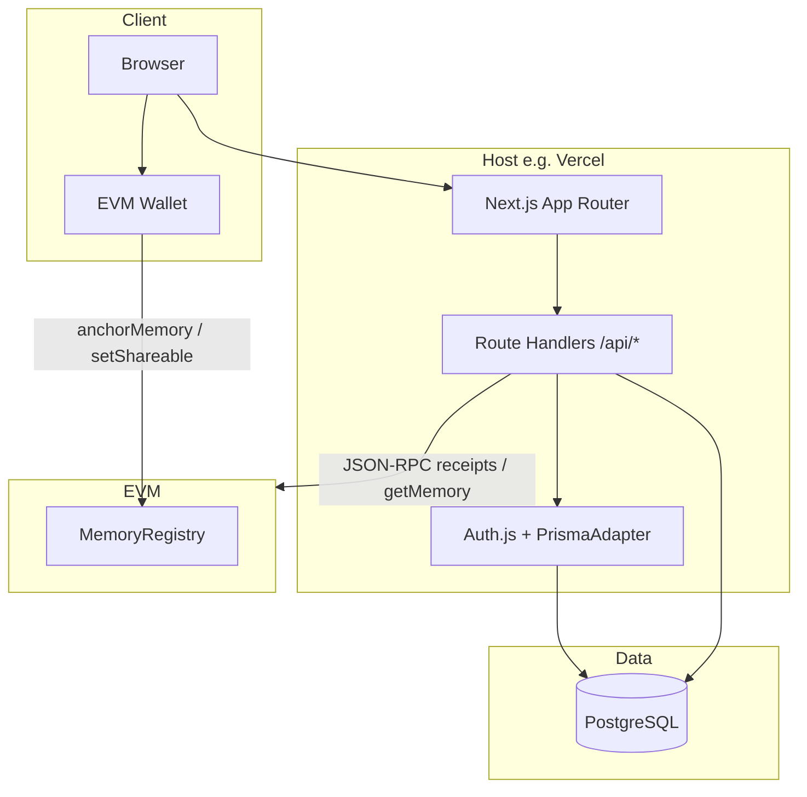
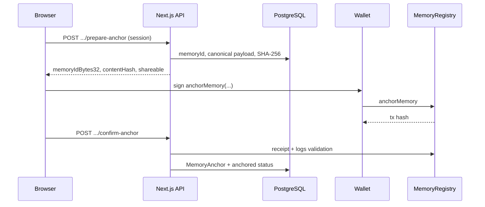

# Missing You

**A calm, bilingual memorial journal with optional on-chain proof — not on-chain prose.**

Missing You is a full-stack web app for writing and preserving memories of people you miss. Journal text lives in PostgreSQL under your control; the blockchain records only a compact **proof of existence** (hash + metadata) so you can verify *that* a memory was committed *when* you say it was — without putting private writing on a public ledger.

English and Traditional Chinese (`en` / `zh-TW`) ship first-class. The stack is a **pnpm + Turborepo** monorepo: **Next.js 15** (App Router), **Prisma**, **Auth.js** (email magic links), and **wagmi / viem** for optional EVM anchoring via **`MemoryRegistry`**.

<p align="center">
  <a href="https://nodejs.org/"></a>
  <a href="https://pnpm.io/"></a>
  <a href="https://nextjs.org/"></a>
  <a href="https://www.prisma.io/"></a>
  <a href="https://book.getfoundry.sh/"></a>
  
</p>

> **CI:** On GitHub, `.github/workflows/ci.yml` runs web lint, Vitest, production build, and Foundry tests on pushes and pull requests. Replace this note with a status badge once the repository URL is public.

---

## Overview

### The problem

People grieving or remembering loved ones need a **respectful, private** place to write — and sometimes a **credible signal** that a memory was captured at a certain time, without exposing full text on-chain or turning remembrance into crypto spectacle.

### What Missing You does

- **Writes** rich journal entries **off-chain** (PostgreSQL), with **privacy** modes (`private` | `share`) and lifecycle (`draft` → optionally **anchored**).
- **Anchors** a **canonical payload**’s **SHA-256** hash on an EVM chain through **`MemoryRegistry`**: `memoryId`, `contentHash`, owner address, shareability — **never** the prose in calldata.
- **Verifies** locally (re-hash) and on-chain (`getMemory` / `verifyMemory`) when RPC is configured.
- **Localizes** the experience for English and Traditional Chinese readers with intentional typography and calm UX.

### Who it’s for

- Individuals and families who want a **quiet** memorial journal, not a trading or NFT product.
- Developers evaluating **hybrid Web2 + Web3** patterns: familiar auth + DB, minimal chain footprint, clear security boundary.

### Why it matters

The architecture makes an explicit trade-off: **the operator’s database remains the source of truth for availability and full text**; the chain provides an **independent verification path** for hash and timing. That honesty — plus privacy defaults and no prose on-chain — is the differentiator.

---

## Key features

### User-facing

| Area | Behavior |
|------|----------|
| **Journaling** | Create and edit entries; optional title, person name; default privacy is private. |
| **Auth** | Email magic links via **Auth.js** (NextAuth v5 beta) and Prisma adapter. |
| **Wallet** | Connect with **wagmi**; optional **WalletConnect** project ID for mobile-friendly flows. |
| **Wallet link** | Settings flow ties an EVM address to the signed-in user (challenge / confirm API) for a clearer Web2↔Web3 identity story. |
| **Anchoring** | Prepare hash via BFF → user sends `anchorMemory` from wallet → confirm with tx receipt validation on the server. |
| **Sharing** | Shared memories can surface on public routes; **anchored** share toggles may require **`setShareable`** on-chain before the API persists visibility changes. |
| **i18n** | **`next-intl`**, locale-prefixed routes (`/en`, `/zh-TW`). |

### Technical

| Area | Behavior |
|------|----------|
| **Monorepo** | **Turborepo** tasks for `build`, `dev`, `lint`, `typecheck`, `clean`. |
| **Shared packages** | `@missing-you/shared` (Zod, types, chain helpers, ABI fragments); `@missing-you/ui` (Radix + CVA primitives). |
| **API** | Next.js **Route Handlers** under `/api/*` (journals, anchor prepare/confirm, health/ready, wallet link). |
| **Quality** | ESLint (web), Vitest (web), Foundry tests (contracts); optional local pre-commit hook runs a strict subset. |

### Web3 / blockchain

- **Contract:** `MemoryRegistry` — `anchorMemory`, `getMemory`, `verifyMemory`, `setShareable`; OpenZeppelin **Ownable** + **Pausable**.
- **Chains:** Configurable; examples in repo include **Ethereum mainnet**, **Sepolia**, **Polygon Amoy**, **Polygon** — align `NEXT_PUBLIC_ANCHOR_CHAIN_ID` and deployed address with your deployment.
- **Client:** Wallet submits transactions; server validates receipts and RPC reads before persisting `MemoryAnchor` rows.

### Privacy & security (high level)

- Full journal content **stays off-chain** by design.
- Private journals are **not** exposed to non-owners (treated as not found).
- Tx confirmation checks receipt status and contract target before DB writes.
- Deep-dive: [`docs/security-and-hardening.md`](./docs/security-and-hardening.md).

---

## Tech stack

| Layer | Technology |
|--------|------------|
| **Language** | TypeScript 5.8 |
| **Frontend** | React 19, Next.js 15 (App Router, Turbopack in dev), Tailwind CSS 3.4 |
| **i18n** | next-intl 3.x |
| **Data fetching** | TanStack Query (app-level provider; feature hooks as needed) |
| **Auth** | Auth.js v5 beta, `@auth/prisma-adapter`, Nodemailer for magic links |
| **Backend** | Next.js Route Handlers (BFF), Prisma 6 |
| **Database** | PostgreSQL 14+ |
| **Web3** | wagmi 2, viem 2; optional WalletConnect |
| **Smart contracts** | Solidity, Foundry, OpenZeppelin Contracts 5.1 |
| **Repo tooling** | pnpm 9 workspaces, Turborepo 2.5, Prettier 3 |
| **CI** | GitHub Actions: pnpm install, shared build, web lint/test/build, `forge test` |

---

## Architecture overview

The deployable surface is a **single Next.js app**: UI, localization, and `/api/*` live together. PostgreSQL holds users, sessions, journals, anchor metadata, and wallet-link challenges. The EVM network holds **hash + metadata** only.



**Anchor lifecycle (simplified):**



**Package relationships:** `apps/web` depends on `@missing-you/shared` and `@missing-you/ui`. Contract **ABI and address** must stay aligned with `packages/contracts` deployments (ABI is mirrored for the app; contracts are not imported at Next runtime).

---

## Project structure

| Path | Purpose |
|------|---------|
| [`apps/web/`](./apps/web/) | Next.js application: `app/` routes, `components/`, `lib/`, Prisma schema & migrations, Vitest, `messages/` for i18n. |
| [`packages/shared/`](./packages/shared/) | Domain types, Zod schemas, chain config, canonical hashing helpers, ABI fragments — compiled to `dist/`. |
| [`packages/ui/`](./packages/ui/) | Shared UI primitives (e.g. Button, Container, `cn`) for consistent styling. |
| [`packages/contracts/`](./packages/contracts/) | Foundry project: `MemoryRegistry.sol`, deploy scripts, tests, ABI export scripts, `deployments/`. |
| [`docs/`](./docs/) | Product overview, architecture, deployment, security, QA, and user guides (EN / zh-TW). |
| [`scripts/`](./scripts/) | Git hook installer and `precommit-check.sh`. |
| [`.github/workflows/`](./.github/workflows/ci.yml) | CI pipeline definitions. |

---

## Getting started

### Prerequisites

- **Node.js** ≥ 20  
- **pnpm** 9.x — e.g. `corepack enable && corepack prepare pnpm@9.15.4 --activate`  
- **PostgreSQL** 14+ for Prisma  
- **Foundry** (`forge`) — only if you compile, test, or deploy contracts  

### Install

```bash
git clone <your-fork-or-upstream-url>
cd missing-you
pnpm install
```

`postinstall` builds `@missing-you/shared` and `@missing-you/ui` so consumers resolve `dist/` types.

### Environment

```bash
cp apps/web/.env.example apps/web/.env.local
```

Fill at minimum:

- `DATABASE_URL` — Postgres connection string  
- `AUTH_SECRET` — strong random secret (e.g. `openssl rand -base64 32`)  
- `AUTH_URL` — app origin (e.g. `http://localhost:3000`)  
- `AUTH_EMAIL_SERVER` / `AUTH_EMAIL_FROM` — SMTP for magic links (dev may log links if SMTP is empty — see example file)  
- For anchoring: `NEXT_PUBLIC_ANCHOR_CHAIN_ID`, `NEXT_PUBLIC_MEMORY_REGISTRY_ADDRESS`, and the matching **server** RPC URL(s) from `.env.example`  

Never commit `.env.local` or deployer private keys.

### Database

**Docker example:**

```bash
docker run --name missing-you-pg \
  -e POSTGRES_PASSWORD=postgres \
  -e POSTGRES_DB=missing_you \
  -p 5432:5432 -d postgres:16
```

**Migrations:**

```bash
pnpm --filter @missing-you/web db:migrate
# or during early schema iteration:
pnpm --filter @missing-you/web db:push
pnpm --filter @missing-you/web db:studio
```

### Local development

From repo root:

```bash
pnpm dev
```

Opens the app (default [http://localhost:3000](http://localhost:3000)); middleware redirects to a locale prefix (e.g. `/en`).

Web only:

```bash
pnpm --filter @missing-you/web dev
```

Production-like build:

```bash
pnpm build
# or
pnpm --filter @missing-you/web build
```

`@missing-you/web` runs `prisma generate` before `next build`.

### Contracts (Foundry)

Foundry is **not** part of `pnpm build` so web developers can work without `forge`.

```bash
cd packages/contracts
forge install foundry-rs/forge-std
forge install OpenZeppelin/openzeppelin-contracts@v5.1.0
forge build
forge test
```

Deploy and ABI export: see [`packages/contracts/README.md`](./packages/contracts/README.md). For Vercel + Ethereum mainnet specifically: [`docs/production-vercel-ethereum.md`](./docs/production-vercel-ethereum.md).

### Health & readiness

| Endpoint | Role |
|----------|------|
| `GET /api/health` | Liveness — JSON `ok` |
| `GET /api/ready` | Readiness — env / dependency completeness |

### Troubleshooting

| Symptom | Check |
|---------|--------|
| Locale redirect loops / 404 on `/` | Use `/en` or `/zh-TW`; confirm middleware + `next-intl` config. |
| Prisma errors on start | `DATABASE_URL`, migrations applied, DB reachable. |
| Magic link not received | SMTP in prod; dev console logs when `AUTH_EMAIL_SERVER` is unset. |
| Anchor confirm fails | Chain ID and contract address match deployment; server RPC can read receipts; user paid gas on correct network. |
| Type errors in monorepo | Run `pnpm install` (postinstall builds shared/ui); `pnpm --filter @missing-you/shared build`. |

---

## Smart contracts & blockchain

| Topic | Detail |
|-------|--------|
| **Artifact** | `MemoryRegistry` in [`packages/contracts/src/MemoryRegistry.sol`](./packages/contracts/src/MemoryRegistry.sol) |
| **Purpose** | Store **hash + structured metadata**; prove commitment time and integrity without storing journal text |
| **User actions** | `anchorMemory`, `setShareable` (when share rules require on-chain flag) |
| **Reads** | `getMemory`, `verifyMemory` — used by API for verification UIs and checks |
| **Deploy** | Foundry script `script/Deploy.s.sol`; env vars for RPC + `PRIVATE_KEY` (never commit) |
| **Web config** | `NEXT_PUBLIC_MEMORY_REGISTRY_ADDRESS`, `NEXT_PUBLIC_ANCHOR_CHAIN_ID`, server-side RPC URLs per network |
| **Wallet** | Injected providers and optional WalletConnect; linking flow under **Settings** for associating address with account |

**Security mindset:** treat the contract as **integrity infrastructure**, not confidentiality. Audit contract upgrades, pausing, and ownership; keep RPC keys server-side; validate every receipt before trusting DB state. See [`docs/security-and-hardening.md`](./docs/security-and-hardening.md).

---

## Development workflow

| Task | Command |
|------|---------|
| Dev (all turbo dev tasks) | `pnpm dev` |
| Lint (workspace) | `pnpm lint` |
| Typecheck (workspace) | `pnpm typecheck` |
| Format (Prettier) | `pnpm format` |
| Web unit tests | `pnpm --filter @missing-you/web test:run` |
| Web interactive tests | `pnpm --filter @missing-you/web test` |
| Contract tests | `pnpm --filter @missing-you/contracts test` |
| Full local gate (lint, tests, web build; contracts if `forge` exists) | `pnpm precommit:check` |
| Install git hook | `pnpm hooks:install` |
| Clean | `pnpm clean` |

---

## Contributing

We welcome issues and pull requests that respect the product’s tone: **privacy-first, non-exploitative, technically honest**.

1. **Branching:** Use feature branches off `main`; keep changes focused.  
2. **Before you PR:** `pnpm precommit:check` locally when possible; CI must pass (web lint, Vitest, Next build, Foundry tests).  
3. **Style:** Match existing TypeScript/React patterns; avoid drive-by refactors unrelated to your change.  
4. **Contracts:** ABI changes should stay in sync with exported artifacts and app constants.  
5. **Issues:** Include repro steps for bugs, and security-sensitive reports should follow [`docs/security-and-hardening.md`](./docs/security-and-hardening.md) guidance if applicable.  

---

## Roadmap & future plans

Near-term priorities that fit the current architecture:

- **Hardening:** Rate limits, structured audit logs, deeper tx / event validation where needed.  
- **Observability:** Monitoring, alerting, and runbooks for production operators.  
- **Security testing:** Expanded API fuzzing and E2E regression around auth, privacy, and anchor edge cases.  
- **Product:** Richer editor experience and continued i18n polish while keeping off-chain/on-chain boundaries crisp.  

Scaling vision stays **operational simplicity**: one primary web deploy, one registry contract per supported chain environment, managed Postgres — unless a future fork explicitly targets full decentralized storage.

---

## Documentation

| Doc | Description |
|-----|-------------|
| [`docs/overview.md`](./docs/overview.md) | Product overview |
| [`docs/architecture.md`](./docs/architecture.md) | Architecture notes |
| [`docs/technical-system-documentation.md`](./docs/technical-system-documentation.md) | Deep system reference |
| [`docs/deployment.md`](./docs/deployment.md) | Deployment guide |
| [`docs/production-vercel-ethereum.md`](./docs/production-vercel-ethereum.md) | Vercel + Ethereum mainnet |
| [`docs/security-and-hardening.md`](./docs/security-and-hardening.md) | Security |
| [`docs/user-readme.md`](./docs/user-readme.md) / [`docs/user-readme.zh-TW.md`](./docs/user-readme.zh-TW.md) | User-facing guides |

---

## License & credits

**License:** This repository is currently **private / unlicensed** — there is no root `LICENSE` file. Add an explicit license before open-sourcing; until then, default copyright applies.

**Third parties:** Solidity builds depend on [OpenZeppelin Contracts](https://github.com/OpenZeppelin/openzeppelin-contracts) and [forge-std](https://github.com/foundry-rs/forge-std); see vendor licenses under `packages/contracts/lib/`.

**Contributors:** Add a `CONTRIBUTORS.md` or GitHub contributors section when the project goes public.

---

<p align="center"><strong>Missing You</strong> — remember privately. Prove carefully.</p>
