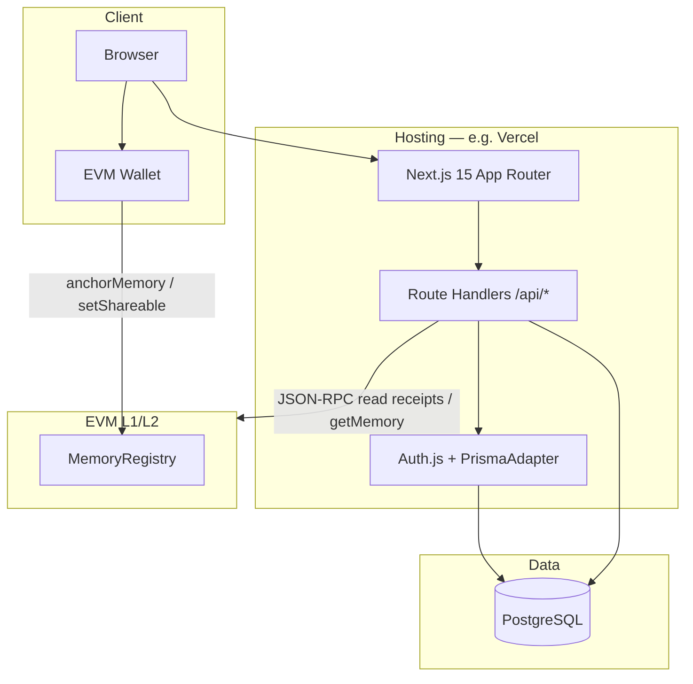
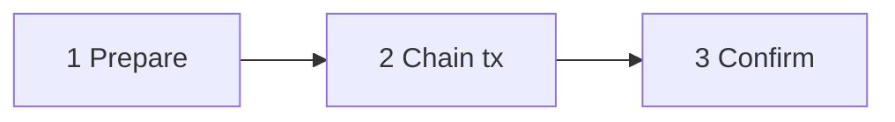
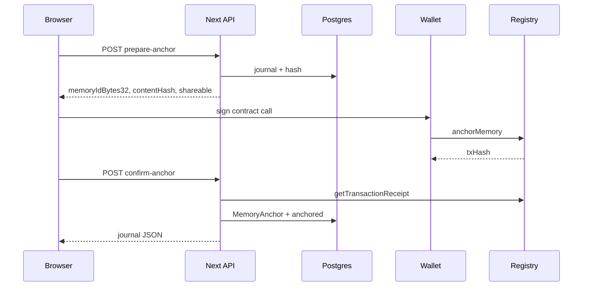

# Missing You — Technical System Documentation

**Document type:** architecture reference, onboarding guide, and design review  
**Audience:** software engineers, architects, technical product managers, blockchain engineers, technical due diligence  
**Scope:** repository state as of the inspected codebase (pnpm monorepo, Next.js 15 app, Prisma/PostgreSQL, Foundry/Solidity)

---

## Executive Summary

**Missing You** is a full-stack web application for writing and preserving personal memorial journals. The product emphasizes **calm UX**, **privacy by default**, and **optional cryptographic anchoring**: full journal text stays in PostgreSQL; the blockchain layer stores only a compact **proof-of-existence** (`memoryId`, `contentHash`, owner address, timestamp, shareability flag) via a single Solidity contract, `MemoryRegistry`.

The system is implemented as a **TypeScript monorepo** orchestrated by **Turborepo** and **pnpm**. The primary deployable is **`@missing-you/web`**, a **Next.js 15** (App Router) application that serves UI, localized content, REST-style **Route Handlers** under `/api/*`, and integrates **Auth.js v5** (email magic link) with **Prisma**. Wallet connectivity uses **wagmi 2** and **viem**; optional **WalletConnect** improves mobile flows. Shared TypeScript libraries (`@missing-you/shared`, `@missing-you/ui`) isolate domain types, Zod schemas, chain configuration, ABI fragments, and a small Radix-based UI kit.

**Architectural thesis:** combine familiar Web2 auth and rich text storage with a minimal on-chain footprint so users get verifiable timestamps and integrity signals without putting sensitive prose on a public ledger. **Trade-off:** trust and UX remain dependent on the operator-controlled database and BFF; the chain provides an **independent verification path** for the hash and metadata, not for availability or confidentiality of the full text.

---

## Product Overview

### Problem and core concept

- **Problem:** People want a dedicated, respectful space to record memories of loved ones, with control over visibility and a way to **demonstrate that a memory existed at a point in time** without exposing full content on-chain.
- **Core concept:** Each “journal” is an off-chain document with **privacy** (`private` | `share`) and **lifecycle** (`draft` | `anchored`). Anchoring computes a **canonical JSON payload** and **SHA-256** digest, then records that digest on-chain under a deterministic `bytes32` key derived from a UUID.

### User scenarios (inferred from UX and copy)

| Scenario | Flow |
|----------|------|
| Private writing | Email sign-in → create draft → content in Postgres only |
| Optional anchor | Connect wallet → `prepare-anchor` (BFF) → `anchorMemory` tx → `confirm-anchor` (BFF validates receipt) |
| Share | Set visibility to `share`; for **anchored** memories, **`setShareable` on-chain** is required before the API persists the change |
| Public verification | `/memory/[id]` for shared entries shows content plus **local hash check** and **on-chain read** when RPC is configured |

Target users include bereaved individuals and families seeking a **quiet** memorial tool, and technically minded users who value **auditability** of the anchor.

### Design philosophy (evidence in code)

| Theme | Implementation |
|-------|----------------|
| Privacy | Default `private`; full text never sent in chain tx calldata for anchoring (only `memoryId` + `contentHash` + `shareable`) |
| Decentralization (partial) | Chain is a verification layer; product is not “fully decentralized storage” |
| Memorial / emotional UX | Typography (IBM Plex Sans, Fraunces), i18n including `zh-TW`, gentle copy in message files |
| Trust | Dual verification: re-hash in API (`verification.service`) + `getMemory` / `verifyMemory` via RPC |
| Operational simplicity | Single Next.js deploy surface, one contract, managed Postgres |

---

## System Architecture

### Repository structure

```
missing-you/
├── apps/
│   └── web/                 # Next.js application (UI + API routes + Prisma)
├── packages/
│   ├── contracts/           # Foundry: MemoryRegistry + tests + deploy script
│   ├── shared/              # Types, Zod, viem chains, ABI, memoryId helper
│   └── ui/                  # Button, Container, CVA + tailwind-merge utilities
├── docs/                    # Deployment and user-facing guides
├── scripts/                 # Git hooks / precommit helpers
├── turbo.json
├── pnpm-workspace.yaml
└── .github/workflows/ci.yml
```

**Assumption:** There is no separate standalone Node API service or worker service in-repo; background work is synchronous within Route Handlers.

### High-level architecture



### Request and anchor lifecycle

There are **three steps**. Steps **1** and **3** are **HTTP POST** calls to the Next.js API (browser sends cookies). Step **2** is **not** HTTP: the wallet submits one **on-chain** transaction (`anchorMemory`).

**Endpoints** (same `journalId` UUID for both POSTs):

| Step | Method | Path |
|------|--------|------|
| 1 | `POST` | `/api/journals/{journalId}/prepare-anchor` |
| 3 | `POST` | `/api/journals/{journalId}/confirm-anchor` |

**Step 3 body (JSON):** `txHash`, `chainId`, `contractAddress` — returned from step 2 plus your configured registry address.



- **1 Prepare:** API ensures draft + owner, persists `memoryId` if needed, returns `memoryIdBytes32`, `contentHash`, `shareable`. No private key on server.
- **2 Chain tx:** Browser/wallet calls `MemoryRegistry.anchorMemory`. Costs gas. Produces `txHash`.
- **3 Confirm:** API loads the receipt over JSON-RPC, then writes `MemoryAnchor` and sets `Journal.status` to `anchored`.



**Why two POSTs?** The server must not forge the chain transaction; only the wallet can. The second POST lets the API **verify** the real `txHash` before updating the database.

### Web2 + Web3 boundary

| Concern | Web2 | Web3 |
|---------|------|------|
| Identity | Email + session (database sessions via Auth.js) | Wallet used for **tx submission**; optional **wallet link** (sign message) stores `User.walletAddress` |
| Authorization | `requireApiUser` → `auth()` session | On-chain **owner** is `msg.sender` of `anchorMemory`, not automatically the linked email user |
| Data | Source of truth for **content** | Source of truth for **committed hash + owner + time** |

### Package dependency map

```mermaid
flowchart LR
  web[@missing-you/web]
  shared[@missing-you/shared]
  ui[@missing-you/ui]
  contracts[@missing-you/contracts]

  web --> shared
  web --> ui
  web -.->|ABI must match Solidity| contracts
```

`next.config.ts` transpiles `@missing-you/shared` and `@missing-you/ui` from source; contracts are not imported at runtime by the web app — alignment is operational (deploy addresses + ABI copy in `memoryRegistryAbi.ts`).

---

## Frontend Architecture

### Stack

| Layer | Technology |
|-------|------------|
| Framework | Next.js **15.2**, React **19**, TypeScript **5.8** |
| Styling | Tailwind CSS **3.4**, global tokens in `app/globals.css` |
| i18n | **next-intl** 3.x, `localePrefix: 'always'` (`en`, `zh-TW`) |
| Server components | Default for pages; client islands for wallet/forms |
| Client data | **TanStack Query** (provider only; usage per feature) |
| Web3 | **wagmi** + **viem**, optional WalletConnect |

### Routing strategy

- **App Router** with dynamic `[locale]` segment; `middleware.ts` uses `next-intl` middleware and matcher excluding `api`, `_next`, static files.
- **Root `app/layout.tsx`** passes children through; **locale layout** sets `<html lang>`, fonts, `NextIntlClientProvider`, `Providers` (wagmi + QueryClient).

### State and data fetching

- **Server:** Direct service calls in RSC pages (e.g. public memory page loads journal + chain verification).
- **Client:** Hooks `use-anchor-memory.ts` and `use-shareability-toggle.ts` orchestrate BFF + wallet writes; journal detail uses `fetch` to `/api/journals/...` with session cookies.

### UI architecture

- **`@missing-you/ui`:** `Button` (Radix Slot + CVA), `Container`, `cn()` helper — intentionally small surface.
- **App components:** `components/journals/*`, `components/landing/*`, `components/auth/*`, `components/blockchain/*`, layout chrome in `site-header` / `site-footer`.

### i18n

- Messages live in `apps/web/messages/en.json` and `apps/web/messages/zh-TW.json`.
- Routing and constants: `SUPPORTED_LOCALES` / `DEFAULT_LOCALE` in `@missing-you/shared`; `lib/i18n/routing.ts` wires `defineRouting`.
- **SEO:** `generateMetadata` in locale layout reads `metadata` from message files; public memory pages build dynamic titles/descriptions and Open Graph.

### Rendering choices

| Page type | Pattern |
|-----------|---------|
| Marketing / help | RSC + translations |
| Sign-in | RSC shell + client form |
| Owner journal detail | Mixed — anchor/share controls are client |
| Public memory | RSC for content + proof section |

### Performance and security (client)

- **Performance:** Static params for locales; no heavy client state layer; Turbopack in dev.
- **Security:** Session cookie auth for mutations; wallet only for chain writes; env-driven contract address; **no** client-side storage of secrets. **CSP / headers** — not centrally documented in-repo (assumption: platform defaults).

### Folder structure (web app, abbreviated)

```
apps/web/
├── app/
│   ├── [locale]/           # Localized pages
│   ├── api/                # Route handlers
│   └── layout.tsx
├── components/
├── hooks/
├── lib/                    # config, hashing, blockchain helpers, i18n, db client
├── messages/
├── prisma/
├── server/                 # services, repositories
└── tests/
```

---

## Backend Architecture

### API surface

All backend logic is **Next.js Route Handlers** (`app/api/**/route.ts`). There is no separate Express/Fastify server.

| Route area | Responsibility |
|------------|----------------|
| `auth/[...nextauth]` | Auth.js handlers |
| `journals` | List/create (auth) |
| `journals/[id]` | GET (public if `share`, else owner), PATCH privacy |
| `journals/[id]/prepare-anchor` | Compute hash + memory key |
| `journals/[id]/confirm-anchor` | Validate tx, write `MemoryAnchor` |
| `public-memories` | Paginated public list (no auth) |
| `account/wallet/*` | Link challenge + confirm (signature) |
| `account/settings` | PATCH `defaultPrivacy` for authenticated user |
| `health`, `ready` | Env completeness probes |

### Service layer

- **`journal.service.ts`:** Validation, ownership checks, canonical payload + hash, anchor preparation, anchoring confirmation, public listing, shareability updates (with on-chain requirement when anchored).
- **`blockchain-proof.service.ts`:** Compare DB anchor metadata to `getMemory` result.
- **`verification.service.ts`:** Recompute hash from journal fields vs stored `contentHash`.
- **`api-error.ts`:** Maps `JournalServiceError`, Zod, and unknown errors to JSON with `requestId`.

### Authentication and authorization

- **Provider:** Email (magic link) via Nodemailer transport; in dev without SMTP, link is logged.
- **Session strategy:** **database** sessions (`Session` model); Prisma adapter persists users, accounts, verification tokens.
- **API guard:** `requireApiUser` returns 401 if `auth()` has no `user.id`.
- **Resource auth:** Private journals return **404** to non-owners (avoid existence leak). Public GET by id allows unauthenticated read only when `privacy === 'share'`.

### Wallet linking

- **Challenge:** `WalletLinkChallenge` row with nonce + expiry; message built in `lib/wallet-link/message.ts`.
- **Confirm:** `viem` `verifyMessage`; on success, `User.walletAddress` unique constraint prevents double-linking across accounts.

### Validation

- **Zod** on API bodies (`server/schemas/journal-api.ts`) and shared input (`journalCreateSchema` in `@missing-you/shared`).

### Infrastructure concerns

| Topic | Status in codebase |
|-------|---------------------|
| Rate limiting | Not implemented in Route Handlers (rely on platform / future middleware) |
| Queues / workers | None |
| File storage | Not used for journals (text in DB) |
| Email | SMTP via Auth.js provider config |

### Observability

- **Logging:** Structured JSON logs to stdout (`lib/observability/logger.ts`) with optional `x-request-id`.
- **Sentry:** `SENTRY_DSN` recognized; `captureException` is a **placeholder** — SDK not wired; DSN logs a warning only.

---

## Database Schema and Data Modeling

### ER diagram (logical)

The earlier version of this diagram listed attributes only for **Journal** and **MemoryAnchor** to emphasize the product data path (writing → anchoring). **Account**, **Session**, and **WalletLinkChallenge** are still first-class tables; they were drawn without attribute blocks purely to reduce visual noise. The diagram below aligns with `schema.prisma` (including auth-adjacent models).

```mermaid
erDiagram
  User ||--o{ Journal : owns
  User ||--o{ Account : has
  User ||--o{ Session : has
  User ||--o| WalletLinkChallenge : may_have
  Journal ||--o| MemoryAnchor : has

  User {
    uuid id PK
    string email UK
    datetime emailVerified
    string name
    string image
    string walletAddress UK
    string defaultPrivacy
    datetime createdAt
  }

  Journal {
    uuid id PK
    uuid userId FK
    string title
    text content
    string person
    string privacy
    string status
    string memoryId
    datetime createdAt
    datetime updatedAt
  }

  MemoryAnchor {
    uuid id PK
    uuid journalId FK UK
    string memoryId
    string contentHash
    string txHash
    string chain
    int chainId
    string contractAddress
    datetime anchoredAt
    datetime createdAt
  }

  Account {
    uuid userId FK
    string type
    string provider PK_part
    string providerAccountId PK_part
    string refresh_token
    string access_token
    int expires_at
    string token_type
    string scope
    string id_token
    string session_state
  }

  Session {
    string sessionToken UK
    uuid userId FK
    datetime expires
  }

  WalletLinkChallenge {
    uuid id PK
    uuid userId FK UK
    string address
    string nonce
    datetime expiresAt
    datetime createdAt
    datetime updatedAt
  }

  VerificationToken {
    string identifier PK_part
    string token PK_part UK
    datetime expires
  }
```

**Note:** `VerificationToken` has **no Prisma relation** to `User` (Auth.js stores `identifier` / `token` / `expires` only). It appears in the diagram as a standalone entity for completeness.

### Table-by-table notes

| Table | Role |
|-------|------|
| **User** | Auth.js user; optional `walletAddress` after link; `defaultPrivacy` for UX defaults |
| **Journal** | Primary content; `memoryId` UUID set before anchor; `status` gates edits |
| **MemoryAnchor** | 1:1 with journal; mirrors chain metadata for verification UI |
| **Account / Session / VerificationToken** | Standard Auth.js adapter schema |
| **WalletLinkChallenge** | Ephemeral signing handoff |

### Constraints and rules (enforced in app + DB)

- **Edits:** Only `draft` journals can be updated (`journal.service`).
- **Anchor:** One anchor per journal; `prepare` assigns stable UUID; `confirm` requires successful receipt to registry.
- **Share toggle for anchored:** Requires `txHash` + `chainId` + `contractAddress` trio so server can re-validate receipt.
- **Cascade:** Deleting user removes journals and anchors.

### Indexing and scale

- `@@index([userId, createdAt])` supports owner timeline queries.
- Public list uses `privacy = share` with pagination (max page size 50) — **assumption:** Postgres sufficient for MVP volume; no full-text search in schema.

### Sensitive data

- **Journal `content`** is sensitive PII/emotional content — encrypted-at-rest depends on **hosting/Postgres provider**, not application-layer encryption in inspected code.

### Migrations

Prisma migrations under `apps/web/prisma/migrations/` include init schema, wallet link challenge, and journal `title` column.

---

## Blockchain and Smart Contract Layer

### Network support

Configured chains (shared + env): **Ethereum mainnet (1)**, **Polygon (137)**, **Polygon Amoy (80002)**, **Sepolia (11155111)**. Default in `getDefaultAnchorChainId()` falls back to **Amoy** when env is unset — important for local/dev behavior.

### Contract: `MemoryRegistry`

**Purpose:** Minimal registry of **memory commitments** — not an NFT, not a token; no ERC-721/1155 interface.

**State (per memory):**

- `memoryId` (`bytes32`), `contentHash` (`bytes32`), `owner` (anchor tx sender), `anchoredAt` (`uint64`), `shareable` (`bool`).

**Functions:**

| Function | Behavior |
|----------|----------|
| `anchorMemory` | One-shot insert; reverts `AlreadyAnchored` if key used |
| `getMemory` | Reverts `NotFound` if missing |
| `verifyMemory` | Returns boolean (safe for off-chain callers) |
| `setShareable` | Only `owner`; toggles flag; emits `ShareableUpdated` |
| `pause` / `unpause` | `onlyOwner` (deployer) — emergency stop |

**Events:** `MemoryAnchored`, `ShareableUpdated` — indexed fields aid explorers/indexers.

**Access control:** `Ownable` for pause; per-record owner for share flag.

**Upgradeability:** **None** — immutable implementation; address changes require redeploy + env update.

**Gas / design:** No on-chain hashing; **canonicalization is entirely off-chain** (documented in NatSpec). This saves gas and centralizes hash rules in the TypeScript stack.

### On-chain vs off-chain

| On-chain | Off-chain |
|----------|-----------|
| Commitment to `contentHash` + ordering via block time | Full text, title, person string |
| Owner address at anchor | Email identity |
| `shareable` flag for **public page policy alignment** (enforced in app + contract) | Authorization to view private entries |

### Wallet integration

- **wagmi** `useWriteContract` for `anchorMemory` and `setShareable`.
- **Transaction confirmation:** Client sends `txHash` to BFF; server uses **viem `getTransactionReceipt`** with retries, checks `status`, `to` address, and presence of **any** log from the registry contract.

### Transaction lifecycle (anchor)

1. Authenticated `prepare-anchor` ensures draft + ownership + persists `memoryId`.
2. User submits tx.
3. `confirm-anchor` validates receipt then writes `MemoryAnchor` and `status = anchored`.

**Assumption:** The wallet account may differ from `User.walletAddress`; the product does not enforce equality between email user and on-chain `owner`.

### Tests (Foundry)

`MemoryRegistry.t.sol` covers anchor/verify, id reuse, owner-only `setShareable`, pause behavior, and non-owner pause rejection — baseline unit coverage, not formal audit.

---

## Design Philosophy and Technical Trade-offs

### Why this stack

| Choice | Rationale |
|--------|-----------|
| Next.js monolith | Fast iteration, one deploy unit, colocated BFF and UI |
| Auth.js + email | Low friction vs wallet-only dapps; fits “gentle” onboarding |
| Prisma + Postgres | Mature relational model for users + journals |
| viem/wagmi | Typed Ethereum interactions; WalletConnect optional |
| Single immutable contract | Predictable security surface; no proxy upgrade complexity |

### Decentralization vs usability

- **Usability wins** for content (editable drafts, fast reads, recovery flows).
- **Decentralization** applies to **tamper-evident commitment** of the hash, not to censorship resistance of the narrative text.

### Security vs UX

- Receipt validation prioritizes **simple heuristics** (success, target, logs) over deep calldata decoding — better UX (fewer failures) but **weaker binding** between tx intent and DB update (see Risks).
- **Recovery UI** in `AnchorMemoryControls` allows pasting `txHash` if confirm step fails after on-chain success — pragmatic resilience.

### Cost vs scalability

- Each anchor and share-toggle on mainnet costs gas; product docs explicitly warn about **mainnet economics**.
- BFF RPC usage scales with confirmation and verification traffic; caching and indexer offload are not present.

### Product emotion vs engineering

- i18n and typography support a contemplative brand; engineering keeps blockchain details visible on dedicated pages and proof panels for transparency.

---

## DevOps, Infrastructure, and Deployment

### CI/CD

GitHub Actions **`.github/workflows/ci.yml`**:

1. **Web job:** `pnpm install --frozen-lockfile`, build `@missing-you/shared`, `next lint`, `vitest run`, `next build`.
2. **Contracts job:** Foundry toolchain, `forge install` dependencies, `forge test`.

**Gap:** CI does not appear to run `turbo` from root for all packages; web job explicitly filters packages.

### Hosting

- Documented path: **Vercel** with root directory `apps/web`, monorepo install/build from repo root (`docs/production-vercel-ethereum.md`).

### Environment management

- **Zod-validated** `lib/config/env.ts` for shape of URLs and chain IDs.
- **Public** vars: `NEXT_PUBLIC_*` for app URL, chain id, contract address, browser RPC, WalletConnect project id.
- **Server-only:** `DATABASE_URL`, `AUTH_SECRET`, SMTP, per-chain RPC for receipts.

### Contract deployment

- `packages/contracts/script/Deploy.s.sol` deploys `new MemoryRegistry(deployer)`; scripts `deploy:sepolia`, `deploy:amoy`, `deploy:polygon`, `deploy:mainnet`.
- Operator copies address into `NEXT_PUBLIC_MEMORY_REGISTRY_ADDRESS`.

### Secrets

- Documented practice: Vercel env UI; never commit keys; dedicated deployer wallet for production.

### Monitoring and analytics

- Structured logs; Sentry optional but not fully integrated.
- No first-party analytics module identified in inspected paths.

### Testing strategy

| Layer | Tooling |
|-------|---------|
| Web unit | Vitest (`tests/services`, `tests/api`) |
| Contracts | Forge tests |
| E2E | Not present in inspected tree |

### Release process

**Assumption:** Git trunk + Vercel preview/production; `prisma migrate deploy` run against production DB as a manual or pipeline step.

---

## Risks, Bottlenecks, and Recommendations

### Security and correctness

| Risk | Severity | Notes |
|------|----------|-------|
| **Receipt validation does not decode calldata or specific events** | Medium | A successful tx to the registry with **some** log could theoretically differ from `anchorMemory` args; recommend decoding `MemoryAnchored` (or verifying input data) and matching `memoryId` + `contentHash`. |
| **On-chain owner vs app user** | Low–Medium | No enforced link between session user and `msg.sender`; accountability is product/legal, not cryptographic. |
| **No API rate limiting** | Medium | Abuse could stress DB and RPC; add edge rate limits or middleware. |
| **Placeholder Sentry** | Low | Errors may be under-reported in production. |
| **Session fixation / Auth hardening** | Operational | Standard Auth.js practices; ensure `AUTH_URL` and cookie settings match production domain. |

### Smart contract

| Topic | Assessment |
|-------|------------|
| Reentrancy | Not applicable (no external calls in state updates beyond OZ patterns) |
| Centralization | Owner can pause all anchors — document for users |
| Immutability | Bug fixes require new deployment + migration of env |

### Technical debt and maintainability

- **ABI sync** between Solidity and `memoryRegistryAbi.ts` is manual — `forge inspect` / codegen script exists as `export:abi` script but discipline is operational.
- **Constants:** `CHAIN_CONFIG_PLACEHOLDER` in shared is legacy comment vs env-driven reality.
- **E2E gap:** Anchor flows are high-value for automated regression.

### Scalability

- Journal text growth increases Postgres size; no sharding/archival strategy in app.
- Public feed is simple pagination; trending or search would need new indexes or external search.

### Suggested improvements (prioritized)

1. **Strict tx parsing** on `confirm-anchor` (and share confirmation) to match function selector + arguments or event topics.
2. **Optional** enforcement: linked wallet must equal anchor `owner` for confirmation.
3. **Wire Sentry** or remove DSN warning noise.
4. **Rate limiting** on `/api/*` and magic-link endpoints.
5. **Contract CI** could use `git submodule` or committed `lib/` to avoid `forge install` drift (evaluate lock strategy).

### Product expansion opportunities

- Rich media attachments (would imply storage + privacy review).
- Delegated guardians / multi-user memorial spaces.
- L2-specific deployments for cheaper anchoring.
- Export / portable data package for user trust.

---

## Appendix

### Key environment variables (non-exhaustive)

| Variable | Role |
|----------|------|
| `DATABASE_URL` | Postgres |
| `AUTH_SECRET`, `AUTH_URL`, `AUTH_EMAIL_*` | Auth.js |
| `NEXT_PUBLIC_APP_URL` | Links and metadata |
| `NEXT_PUBLIC_ANCHOR_CHAIN_ID` | Target chain |
| `NEXT_PUBLIC_MEMORY_REGISTRY_ADDRESS` | Contract |
| `ETHEREUM_MAINNET_RPC_URL` / per-chain server RPC | Receipt + `getMemory` |
| `NEXT_PUBLIC_*_RPC_URL` | Browser reads |
| `NEXT_PUBLIC_WALLETCONNECT_PROJECT_ID` | Mobile wallets |

### Representative implementation references

- Canonical hashing rules: `apps/web/lib/hashing/canonical.ts`
- Anchor orchestration hook: `apps/web/hooks/use-anchor-memory.ts`
- Journal domain service: `apps/web/server/services/journal.service.ts`
- Contract: `packages/contracts/src/MemoryRegistry.sol`
- Prisma schema: `apps/web/prisma/schema.prisma`
- Auth config: `apps/web/auth.ts`
- Production deployment: `docs/production-vercel-ethereum.md`

### Root scripts (monorepo)

| Script | Purpose |
|--------|---------|
| `pnpm dev` | `turbo run dev` |
| `pnpm build` | `turbo run build` |
| `pnpm lint` / `typecheck` | Turbo tasks across packages |
| `postinstall` | Build `shared` and `ui` |

### Dependency highlights

- **Web:** `next`, `react`, `next-auth`, `@auth/prisma-adapter`, `@prisma/client`, `next-intl`, `wagmi`, `viem`, `@tanstack/react-query`, `zod`, `nodemailer`
- **Shared:** `viem`, `zod`
- **UI:** `@radix-ui/react-slot`, `class-variance-authority`, `clsx`, `tailwind-merge`
- **Contracts:** `forge-std`, OpenZeppelin **Ownable**, **Pausable**

---

*This document synthesizes static code review. Runtime behavior (exact Auth.js cookie names, Vercel limits, third-party RPC SLAs) should be validated in the target deployment environment.*
